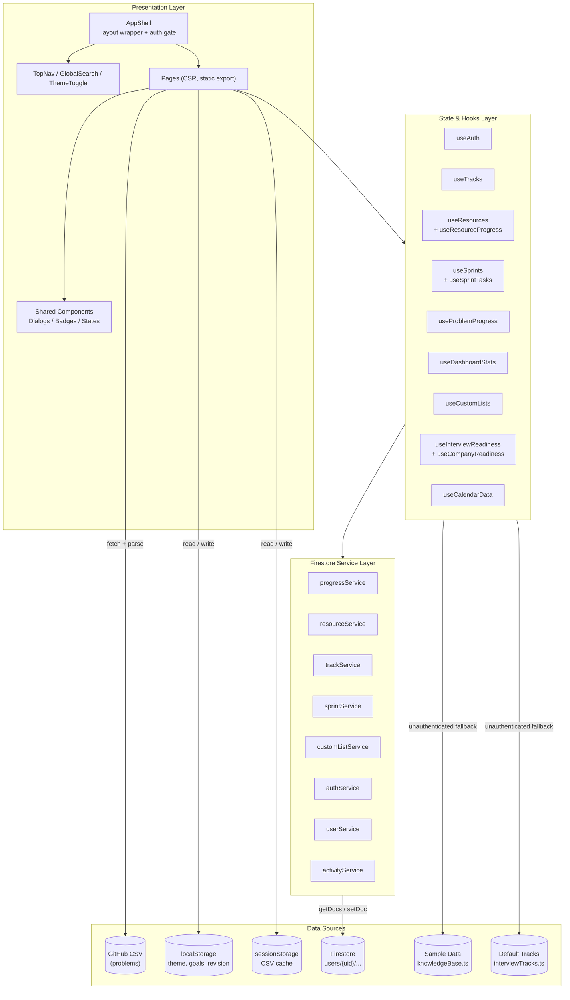

# Interview Tracly — Architecture Document

> *Review date: July 2026*
> *See [Implementation Plan](IMPLEMENTATION_PLAN.md) for the phased feature roadmap.*

---

## High-Level Architecture



**Key architectural principles:**
- **Static export** (`output: 'export'`): Zero server runtime. All data fetched client-side after JS hydration.
- **Real-time listeners**: All 5 data hooks use `onSnapshot` for cross-tab live updates.
- **Optimistic updates**: Every mutation updates local state immediately, syncs to Firestore in background, rolls back on failure via ref mirror + pre-mutation snapshot.
- **Feature-sliced**: Hooks encapsulate all data logic; pages are thin composition layers.
- **Parallel systems**: "Problems" (CSV-sourced LeetCode) and "Knowledge Resources" (Firestore-stored prep materials) coexist with separate data models but unified UI patterns.
- **Offline persistence**: `enableMultiTabIndexedDbPersistence` enabled at Firebase init.

---

## 1. Data Architecture

### Firestore Schema — All under `users/{uid}/`

| Collection | Document ID | Key Fields | Service |
|---|---|---|---|
| `users/{uid}/progress/{problemId}` | Problem slug | `solved`, `attempted`, `bookmarked`, `inRevisionList`, `notes`, timestamps | `progressService.ts` |
| `users/{uid}/activity/{date}` | ISO date | `solvedCount`, `attemptedCount` (atomic increments) | `progressService.ts` |
| `users/{uid}/resources/{resourceId}` | Auto `res_...` | `title`, `company`, `track`, `difficulty`, `tags`, `resourceLinks[]`, `askedAt`, `notes` | `resourceService.ts` |
| `users/{uid}/resourceProgress/{resourceId}` | Auto | `status`, `inRevisionList`, `personalNotes`, timestamps | `resourceService.ts` |
| `users/{uid}/tracks/{trackId}` | User/auto | `name`, `icon`, `color`, `description`, `shortDescription` | `trackService.ts` |
| `users/{uid}/sprints/{sprintId}` | Auto `sprint_...` | `name`, `goal`, `status`, `type` (learning/interview/certification/custom), `company`, `role`, `interviewDate`, `targetLevel`, `stages`, `template`, `pausedSprintId`, `capacityHours`, `retro?`, timestamps | `sprintService.ts` |
| `users/{uid}/sprints/{sprintId}/tasks/{taskId}` | Auto `task_...` | `SprintTaskV2`: `type`, `itemId`, `title`, `description`, `track`, `category`, `priority`, `difficulty`, `estimatedHours`, `actualHours`, `status` (backlog/todo/in-progress/review/done), `dueDate`, `company`, `tags[]`, `collectionIds[]`, `notes`, `linkedProblemIds[]`, `linkedResourceIds[]`, `order`, timestamps | `sprintService.ts` |
| `users/{uid}/activity/{eventType}` | Auto | `type` (sprint_start/sprint_complete/task_done), `sprintId`, `taskId?`, `title`, `timestamp` | `activityService.ts` |
| `users/{uid}/customLists/{listId}` | Firestore auto | `name`, `description`, `problemIds[]` | `customListService.ts` |
| `users/{uid}` (profile) | UID | `displayName`, `email`, `photoURL`, `lastLoginAt` | `userService.ts` |

### Data Flow Pattern (every data hook)

```
User Action
    ↓
Hook mutation (e.g. addResource)
    ├─ 1. Build new entity with generated ID
    ├─ 2. Optimistic update: refMirror.current + setState
    ├─ 3. Fire-and-forget: service.addResource()
    └─ 4. On error → rollback: restore refMirror to pre-mutation state

Snapshot (real-time):
  onSnapshot callback → merge into refMirror + setState
  Cleanup: unsubscribe on unmount

Special cases:
  - useCustomLists: ref mirror + rollback (same as above, migrated from reload())
  - useSprintTasks: refMirror is a Map<sprintId, SprintTaskV2[]> with deep clone on snapshot
```

### Problem Data (NOT in Firestore)

- **Source**: `https://raw.githubusercontent.com/prakash144/leetcode-company-wise-problems/main/{company}/{list}.csv`
- **Parsing**: `papaparse` in `fetchQuestions.ts` / `fetchUnifiedProblems.ts`
- **Caching**: `sessionStorage` (per-company lists + unified aggregate)
- **Pipeline**: CSV → parsed rows → `Problem[]` → `useProblemWorkspaceData` → `QuestionTable`

---

## 2. Component Architecture

### Routing (static export — all routes known at build time)

| Route | Page | Purpose |
|---|---|---|
| `/` | Dashboard | Profile, stats, widgets, active sprint, quick task status toggle |
| `/problems` | Problems | Filterable workspace with custom list management |
| `/sprints` | Sprints | Sprint list + 5-column Kanban + retro + analytics + timeline |
| `/tracks` | Tracks | Track grid + inline detail view + bookmarked resources |
| `/tracks/[trackId]` | TrackDetail (SSG) | Pre-rendered detail for 7 default tracks |
| `/progress` | Progress | Charts, knowledge base stats, heatmap |
| `/activity` | Activity | Calendar, sprint timeline, daily mission, revision tracker |
| `/readiness` | Readiness | Company readiness score + hero card + action plan + weak areas |
| `/collections` | Collections | Sidebar + filtered problem grid |
| `/settings` | Settings | Theme, accent, account |
| `/favorites` | Favorites | Bookmarked knowledge resources |
| `/mock-test` | MockTest | Multi-section timed mock interview with 7 interview types, configurable company/role/level, section builder, and AI-ready review |
| `/archive` | Archive | Centralized trash/archive with category grouping (sprints, tracks, resources) and type filter, restore and permanent delete |
| `/my-lists`, `/analytics` | Redirect | → `/collections` or `/progress` |

### Component Nesting

```
AppShell
├── TopNav
│   ├── Logo
│   ├── Desktop NavLinks (9 items — incl. MockTest)
│   ├── SearchTrigger → GlobalSearch (Cmd+K Dialog, problems + resources)
│   ├── ThemeToggle
│   ├── UserMenu
│   └── Mobile: Sheet drawer (same 9 items)
├── <main>  ← animate-in fade-in
│   ├── PageHeader
│   └── [Page Content]
└── Footer

Shared Sprint Components:
  SprintDashboardHeader — stat cards (progress, capacity, estimated, remaining) + progress bar + track breakdown
  SprintAnalytics — completed vs remaining, estimated vs actual, track breakdown bars
  SprintBoard — 5-column Kanban (Backlog/ToDo/InProgress/Review/Done) with @dnd-kit
  SortableTaskCard — rich card: priority, track badge, difficulty, est hours, tags, company, edit/delete
  TaskDetailDialog — full editor: all SprintTaskV2 fields, linked problems/resources, tags, notes
  FilterBar — search + dropdowns for track/priority/status/company/difficulty + clear button
  SprintDialog — create/edit: type selector, company template dropdown, interview fields
  SprintCard — sprint list card with suspended badge, countdown, focus indicator
  SprintTimeline — visual sprint transition history
  InterviewCompleteDialog — outcome selection + resume/archive choices
  ConfirmDialog — replaces window.confirm for destructive actions (delete sprint)

Shared Resource Components:
  FavoriteResourcesWidget — bookmarked resources displayed on dashboard
  ResourceQuickLink — compact resource chip for inline linking

Readiness Page Components:
  CompanySelector — company dropdown filter (Overall + 9 companies)
  HeroCard — score ring + level + remaining problems + estimated time
  ReadinessBreakdown — 5-factor progress bars
  ActionPlan — structured action items with checkboxes
  WeakAreas — grouped weak topics/patterns/difficulty
  CompanyProgress — comparison table with logos
  MockInterviewSection — compact readiness summary

Mock Test Components:
  MockTestConfig — interview config: company, role, level, duration, section builder (add/remove/reorder sections by type)
  MockTestActive — active phase: section tabs with progress, per-question actions (solved/partial/skip/hint), timer
  MockTestSummary — full review: score ring, stats grid, difficulty breakdown, section cards, strengths/weaknesses, recommendations, suggested topics, next practice plan, problem breakdown, history
```

### Auth Flow

```
RootLayout (layout.tsx)
  → AuthProvider (context)
    → onAuthStateChanged → user | null
      → AppShell checks isConfigured
        → if not: AuthUnavailable (full-screen)
        → if yes: render children
          → Pages check auth.user individually
            → most show content for guests (Dashboard, Problems, Tracks, Progress, Activity, Readiness, MockTest)
            → some gate behind sign-in (Sprints, Collections)
```

---

## 3. Gap Analysis

### 🔴 Critical Issues

| # | Gap | Location | Impact |
|---|---|---|---|
| G1 | ~~No Firestore index configuration~~ | All service files | ✅ Resolved — `firestore.indexes.json` with 5 compound indexes |
| G2 | ~~Delete sprint doesn't cascade to tasks~~ | `sprintService.ts` | ✅ Already implemented — `deleteSprint()` batch-deletes tasks subcollection |
| G3 | ~~No real-time Firestore listeners~~ | Every service file | ✅ Resolved — switched to `onSnapshot` in all 6 data hooks |
| G4 | ~~Offline persistence not enabled~~ | Firebase init | ✅ Resolved — `enableMultiTabIndexedDbPersistence` added |

### 🟡 Moderate Issues

| # | Gap | Location | Impact |
|---|---|---|---|
| G5 | **No migration path for old sprint tasks** — old `SprintTask` docs lack V2 fields; `migrateTask()` provides defaults but doesn't write back | `sprintService.ts` | Old tasks missing V2 fields remain in Firestore forever |
| G6 | ~~`orderBy("addedAt")` in task queries~~ | `sprintService.ts` | ✅ Resolved — switched to `orderBy("order")` |
| G7 | **CollectionView prop drilling** — ~30 props passed through | `collections/page.tsx` | Hard to maintain; no composition pattern |
| G8 | **Sample resources not database-backed** — merged client-side, not in Firestore | `useResources.ts` | Deleting samples does nothing; ID conflicts possible |
| G9 | ~~No toast/snackbar system~~ | All hooks | ✅ Resolved — Sonner with unique IDs for dedup across all 44+ toast calls |
| G10 | **Toast IDs still inconsistent** — some use `"success"`, some `"toast-success"`, no shared constant | `useSprints.ts` and others | Minor inconsistency; doesn't affect functionality but breaks central dedup management |

### 🟢 Minor / Cosmetic

| # | Gap | Location | Impact |
|---|---|---|---|
| G11 | **No PWA service worker** — `manifest.json` exists but no offline support | Project root | App doesn't work offline despite being static-exportable |
| G12 | **No anonymous auth** — only Google Sign-In | `authService.ts` | Users without Google accounts cannot create persistent data |
| G13 | **GlobalSearch fetches all problems on mount** — 5 remote CSVs on every dialog open | `GlobalSearch.tsx` | Unnecessary network requests after initial cache |
| G14 | **No loading/error states for bookmarks** — `FavoriteResourcesWidget` returns `null` if empty | `FavoriteResourcesWidget.tsx` | No visual feedback while loading |

### ✅ Resolved Gaps (recent production fixes)

| # | Gap | Resolution |
|---|---|---|
| ~~G2~~ | Track deletion orphans resources | Cascade delete with confirmation dialog |
| ~~G3~~ | SprintTask missing `order` field | Added `order?: number` to SprintTask interface |
| ~~G4~~ | useCustomLists skips optimistic updates | Rewritten with ref mirror + rollback pattern |
| ~~G10~~ | Problems not in Global Search | Problems now appear grouped under "Problems" section |
| ~~G9~~ | No toast/snackbar system | Sonner integrated with 44+ toast calls, dedup IDs |
| ~~G6~~ | orderBy("addedAt") instead of order | Switched to `orderBy("order")` in task queries |
| ~~G1/G3/G4~~ | Firestore indexes / real-time / offline | All three resolved |
| ~~—~~ | `window.confirm` on sprint delete | Replaced with `ConfirmDialog` |
| ~~—~~ | `alert()` in mock-test | Replaced with `toast.error` |
| ~~—~~ | Missing `aria-label` on icon-only delete button | Added `aria-label="Delete sprint"` |
| ~~—~~ | Emoji in error boundary | Replaced with SVG AlertTriangle icon |
| ~~—~~ | No `prefers-reduced-motion` | Added CSS rule for `.stagger-group` |
| ~~—~~ | `updateTask` catch used wrong ref | Fixed `sprintsRef` → `tasksRef` |

---

## 4. Feature Roadmap

### ✅ Recently Completed (Phase I — Phase V)

| # | Feature | Phase |
|---|---|---|
| F1 | SprintTask order field | I.1 |
| F2 | Optimistic updates for customLists | I.2 |
| F3 | Cascade track delete with confirmation | I.3 |
| F4 | Problems in Global Search | I.4 |
| F5 | SprintTaskV2 data model | II.1 |
| F6 | SprintDashboardHeader + SprintAnalytics | II.2 |
| F7 | 5-column Kanban | II.3 |
| F8 | Rich task cards | II.4 |
| F9 | Filter + search in Sprint Board | II.5 |
| F10 | TaskDetailDialog | II.6 |
| F11 | SprintAnalytics | II.7 |
| F12 | Dashboard quick status toggle | II.8 |
| F13 | Activity timeline integration | II.9 |
| F14 | Backlog column | II.10 |
| F15 | FavoriteResourcesWidget | II.x |
| F16 | Resources page rewrite | II.x |
| F17 | Firestore indexes config | III.1 |
| F18 | Cascade delete sprint tasks | III.2 |
| F19 | Offline persistence | III.3 |
| F20 | Toast notification system | III.4 |
| F21 | Fix task query ordering | III.5 |
| F22 | Smart Daily Mission | IV |
| F23 | Real-time Firestore listeners | V |
| F24 | Problem Workspace Revert & Polish | 23 |
| F25 | Readiness Page Redesign | 22 |
| F26 | Interview Readiness Dashboard | 21 |
| F27 | Company Readiness | 17 |
| F28 | Daily Mission & Goal Tracking | 16 |
| F29 | Activity Page Redesign | — |
| F30 | Mock Test page | — |

### ✅ Adaptive Sprint System (Phase 24)

| # | Feature | Files |
|---|---|---|
| A1 | `SprintType` enum (learning/interview/certification/custom) | `sprints.ts` |
| A2 | Interview fields: company, role, interviewDate, targetLevel, stages | `sprints.ts` |
| A3 | Company templates: Google, Microsoft, Amazon, Meta, Apple, Netflix | `sprints.ts` (COMPANY_TEMPLATES) |
| A4 | SprintDialog with type selector + company template dropdown | `SprintDialog.tsx` |
| A5 | Focus Mode: auto-pause other active sprints on new activation | `useSprints.ts` |

### ✅ Premium Focus Mode UX (Phase 25)

| # | Feature | Files |
|---|---|---|
| B1 | "Paused" → "Suspended" with reason | `SprintCard.tsx` |
| B2 | Focus Mode banner with reassurance message | `SprintDashboardHeader.tsx` |
| B3 | InterviewCompleteDialog with outcome + resume/archive | New component |
| B4 | SprintTimeline visual component | New component |
| B5 | Suspended card + interview sprint CTA on dashboard | `sprints/page.tsx` |

### ✅ Production Fixes (Phase 25b)

| # | Fix | Files |
|---|---|---|
| C1 | `window.confirm` → ConfirmDialog | `sprints/page.tsx` |
| C2 | `alert()` → toast.error | `mock-test/page.tsx` |
| C3 | Toast dedup IDs across all hooks | `useSprints.ts`, `useTracks.ts`, `useResources.ts`, `useCustomLists.ts`, `useResourceProgress.ts` |
| C4 | `aria-label` on icon-only delete button | Sprint detail view |
| C5 | Emoji → SVG in error boundary | `error.tsx` |
| C6 | `prefers-reduced-motion` for stagger | Global CSS |
| C7 | `updateTask` catch bug (`sprintsRef` → `tasksRef`) | `useSprints.ts` |

### 🚀 Next Up

| # | Feature | Rationale | Effort |
|---|---|---|---|
| F31 | Track Merge / Archive | Full track lifecycle management | 2-3h |
| F32 | Problem ↔ Resource Linking | Bridge parallel data systems | 3-4h |
| F33 | AI Sprint Suggestions | Auto-generate next sprint from retro | 4-6h |

### 📅 Later

| # | Feature | Description |
|---|---|---|
| F34 | PWA / Offline Support | Service worker + cache-first strategy |
| F35 | Data Export / Import | JSON export/import for all user data |
| F36 | Collaborative Sprints | Sprint sharing + task assignment |
| F37 | Kanban Swimlanes | Group sprint tasks by type or company |
| F38 | Readiness Score History | Track readiness score changes over time |
| F39 | Email/PW + Anonymous Auth | Expand beyond Google Sign-In |

---

## 5. Implementation Plan

### Phase I — Core Gap Fixes ✅ DONE

| Item | Effort | Status |
|---|---|---|
| Add `order` field to SprintTask interface | 5 min | ✅ |
| Rewrite useCustomLists with optimistic update pattern | 30 min | ✅ |
| Cascade track delete with confirmation | 20 min | ✅ |
| Add problems to GlobalSearch | 45 min | ✅ |

### Phase II — Sprint Planning Overhaul ✅ DONE

| Component | New Files | Status |
|---|---|---|
| SprintTaskV2 / SprintV2 data model | `src/lib/sprints.ts` | ✅ |
| SprintDashboardHeader + SprintAnalytics | 2 new components | ✅ |
| 5-column Kanban board | `SprintBoard.tsx` rework | ✅ |
| Rich task cards + inline edit | `SortableTaskCard.tsx` | ✅ |
| Filter + search bar | Integrated in SprintBoard | ✅ |
| TaskDetailDialog | New component | ✅ |
| Dashboard quick status toggle | `page.tsx` widget | ✅ |
| Activity timeline integration | `activityService.ts` | ✅ |

### Phase III — Critical Infrastructure Fixes ✅ DONE

| Item | Effort | Status |
|---|---|---|
| Add `firestore.indexes.json` | 15 min | ✅ |
| Cascade delete sprint tasks subcollection | 30 min | ✅ |
| Enable offline persistence | 1 min | ✅ |
| Add Sonner toast notification system | 30 min | ✅ |
| Fix task query `orderBy("addedAt")` → `orderBy("order")` | 15 min | ✅ |

### Phase IV — Smart Daily Mission ✅ DONE

| Item | Effort | Status |
|---|---|---|
| `computeDailyMission()` algorithm | 1h | ✅ |
| Dashboard + Activity integration | 1h | ✅ |

### Phase V — Real-Time Firestore Listeners ✅ DONE

| Item | Effort | Status |
|---|---|---|
| 5 subscribe* functions in services | 1h | ✅ |
| 6 hooks switched to onSnapshot | 1.5h | ✅ |
| Rollback simplification (prevSnapshot pattern) | 30 min | ✅ |

### Phase 24 — Adaptive Sprint System ✅ DONE

| Item | Effort | Status |
|---|---|---|
| SprintType + COMPANY_TEMPLATES | 30 min | ✅ |
| SprintDialog type/company UI | 1h | ✅ |
| Focus Mode (auto-pause) | 1h | ✅ |

### Phase 25 — Premium Focus Mode UX ✅ DONE

| Item | Effort | Status |
|---|---|---|
| Suspended label with reason | 30 min | ✅ |
| Focus Mode banner | 30 min | ✅ |
| InterviewCompleteDialog | 1h | ✅ |
| SprintTimeline | 45 min | ✅ |
| Empty state CTA | 30 min | ✅ |

### Phase 25b — Production Readiness Fixes ✅ DONE

| Item | Effort | Status |
|---|---|---|
| ConfirmDialog for sprint delete | 30 min | ✅ |
| alert → toast in mock-test | 5 min | ✅ |
| Toast dedup IDs (44+ calls) | 1h | ✅ |
| aria-label on delete button | 5 min | ✅ |
| Emoji → SVG in error boundary | 10 min | ✅ |
| prefers-reduced-motion | 5 min | ✅ |
| updateTask catch bug fix | 5 min | ✅ |

### Upcoming

| Phase | Title | Effort | Status |
|---|---|---|---|
| VI | Track Merge / Archive | 2-3h | ⬜ Future |
| VII | Problem ↔ Resource Linking | 3-4h | ⬜ Future |
| VIII | AI Sprint Suggestions | 4-6h | ⬜ Future |
| IX | PWA / Offline Support | 3-4h | ⬜ Future |
| X | Data Export / Import | 2-3h | ⬜ Future |
| XI | Collaborative Sprints | 6-8h | ⬜ Future |

---

## 6. Cross-Cutting Concerns

| Concern | Current Approach | Recommendation |
|---|---|---|
| **Error handling** | Per-hook `setError` string; global `error.tsx` (SVG icon, no emoji) | Consider per-page ErrorBoundary components |
| **Loading states** | Each hook has its own `loading` bool; pages compose them with `||` | Consider `useCombinedLoading` utility for simplicity |
| **Type safety** | Strong interfaces across all data models | Consider `zod` runtime validation for Firestore reads |
| **Performance** | All in-memory filtering; no virtualization | If resources >500, consider `react-window` for grid lists |
| **Accessibility** | Skip-to-content link, aria-labels on interactive elements, report-validity on custom select | Audit with axe-core; add focus trapping in dialogs |
| **Testing** | None | Start with `vitest` on pure functions (readiness scoring, stats computation) |
| **Toast consistency** | Unique IDs on all calls but naming conventions vary (e.g. `"success"` vs `"toast-success"`) | Centralize toast ID constants |

---

> *This document should be updated as the architecture evolves. Key files to watch: `src/hooks/` (data layer), `src/services/firebase/` (persistence), `src/app/` (routes).*
